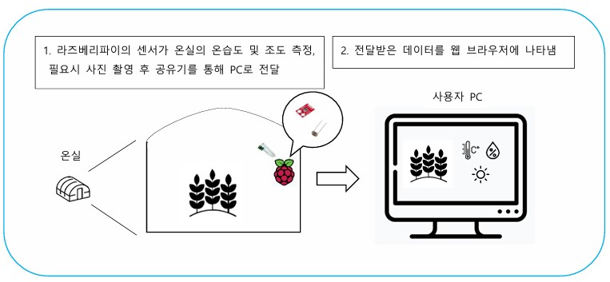
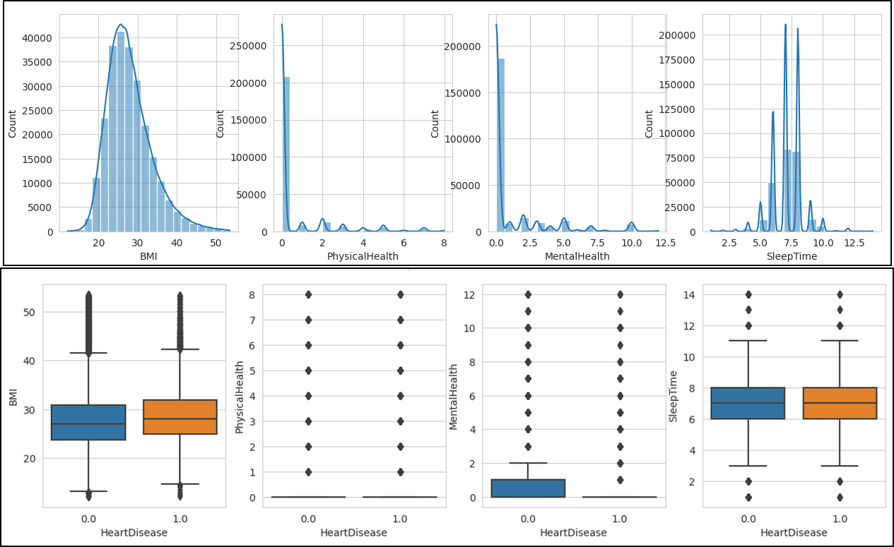
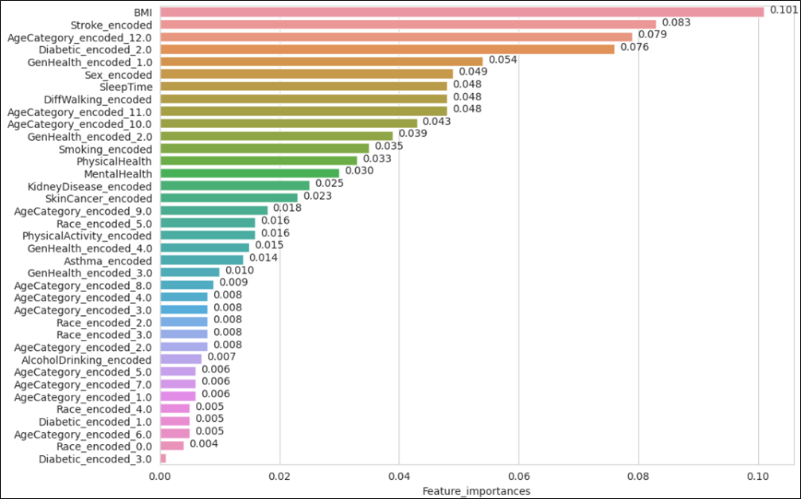
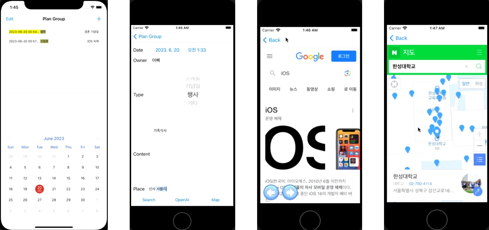
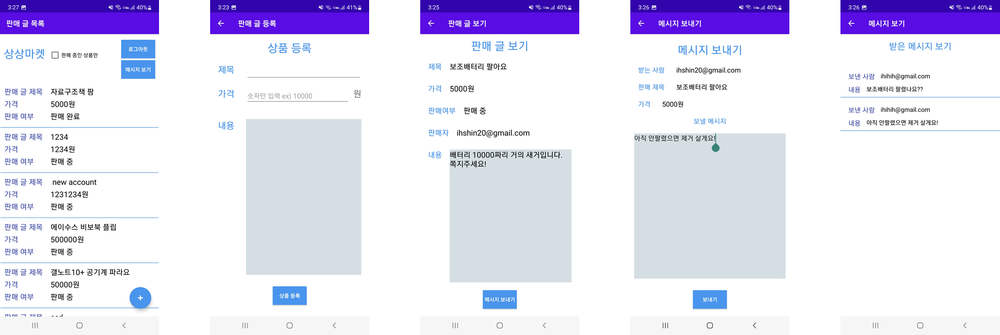
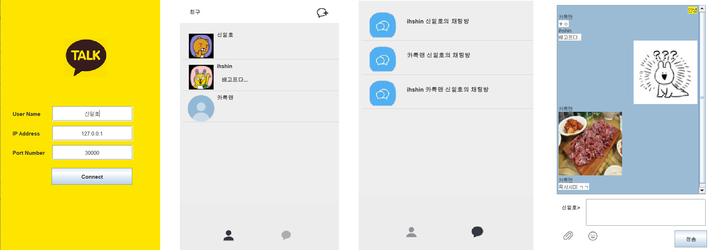
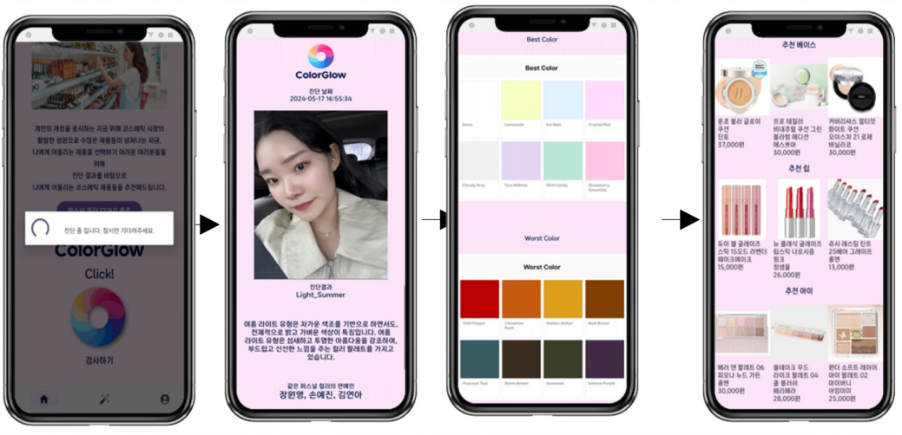

# 🌟 신일호 포트폴리오

제 포트폴리오에 오신 것을 환영합니다! 이곳에서는 제가 작업한 프로젝트들을 소개하며, 프로젝트 제목을 클릭하면 깃허브에서 코드를 확인하실 수 있습니다.

## 📂 프로젝트

### 1. [🌿 온실 농장 서포트 시스템](https://github.com/ihshin20/Greenhouse_Support_System)
**설명:** 마이크로프로세서와 웹 서버를 사용하여 온실 농업을 지원하는 시스템입니다. 환경 요소(온도, 습도, 조도)를 모니터링하고 파이카메라를 이용하여 식물의 상태를 살펴볼 수 있습니다.
- **개발 기간:** 2022-11-09 ~ 2022-12-11
- **개발 언어:** Python, HTML/CSS, JavaScript
- **개발 도구:** Raspberry Pi, PuTTY, Flask, GPIO, MQTT(mosquitto)

### 2. [🏥 빅데이터 분석 프로젝트(심장병, 주택 가격)](https://github.com/ihshin20/Data_Analysis)
**설명:** 범주형 타겟 변수(심장병)과 연속형 타겟 변수(주택 가격)에 대한 데이터 분석 프로젝트입니다.
- **개발 기간:** 2023-05-09 ~ 2023-06-14
- **개발 언어:** Python
- **개발 도구:** Colab, Jupyter Notebook, Pandas, Scikit-learn, Seaborn, Matplotlib, ...

### 3. [📅 iOS용 공유 캘린더](https://github.com/ihshin20/IOS_Calendar)
**설명:** IOS용 공유 캘린더 애플리케이션입니다. 애플리케이션 내부에서 웹 서칭, 지도 찾기, OpenAI API를 이용한 AI 질의응답을 할 수 있습니다.
- **개발 기간:** 2023-05-29 ~ 2023-06-20
- **개발 언어:** Swift
- **개발 도구:** MacOS(VM), Xcode, OpenAI API, Firebase

### 4. [🛒 상상마켓: 중고 거래 마켓 애플리케이션](https://github.com/ihshin20/SangSangMarket)
**설명:** 안드로이드용 중고 거래 마켓 애플리케이션입니다.
- **개발 기간:** 2023-11-06 ~ 2023-12-01
- **개발 언어:** Kotlin, Java
- **개발 도구:** Android Studio, Firebase

### 5. [🩺 환자 정보 조회 애플리케이션](https://github.com/ihshin20/Hospital_AR)
**설명:** 병원 근무자가 AR 디바이스를 이용해 바코드를 마커로 트래킹하여 환자 정보를 조회할 수 있는 애플리케이션입니다.
- **개발 기간:** 2023-11-09 ~ 2023-12-16 
- **개발 언어:** C#
- **개발 도구:** Unity, VSCode, Vuforia

### 6. [🚚 Wagu: 음식 배달 데이터베이스 설계 프로젝트](https://github.com/ihshin20/Wagu)
**설명:** 음식 배달에 대한 데이터베이스를 설계한 후 간단한 시뮬레이션 데스크톱 애플리케이션입니다.
- **개발 기간:** 2023-11-12 ~ 2023-12-16
- **핵심 역할:** 제안서, 테이블 정의서, 업무 분석서 작성, SQLite Database 구축, Python 애플리케이션 개발
- **개발 언어:** Python, SQL
- **개발 도구:** VSCode, PyQT, SQLite, DB Designer

### 7. [💬 멀티톡: 소켓 통신을 이용한 데스크톱 메신저](https://github.com/ihshin20/MultiTalk)
**설명:** 실시간 채팅을 위한 소켓 통신을 이용한 데스크톱 메신저 애플리케이션입니다. 텍스트 메시지, 이모티콘, 이미지 공유, 그룹 채팅을 지원합니다.
- **개발 기간:** 2023-12-01 ~ 2023-12-23
- **개발 언어:** Java
- **개발 도구:** Eclipse

### 8. [🎨 ColorGlow: 퍼스널 컬러 진단 애플리케이션](https://github.com/ihshin20/ColorGlow)
**설명:** Deep Learning을 이용한 퍼스널컬러 자동 진단 및 제품 추천 안드로이드 애플리케이션입니다.
- **개발 기간:** 2024-2-26 ~ 2023-05-31
- **핵심 역할:** 팀장, 프로젝트 기획, 데이터베이스 설계, 데이터 크롤링 및 전처리, CNN모델 및 서버 구축
- **개발 언어:** Python, JavaScript, Kotlin, Java
- **개발 도구:** Android Studio, Runpod, VSCode, Jupyter Notebook, Google Cloud Platform, TensorFlow, OpenCV, dlib, selenium, Firebase

